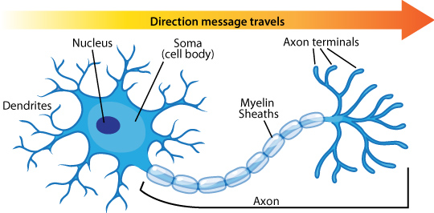
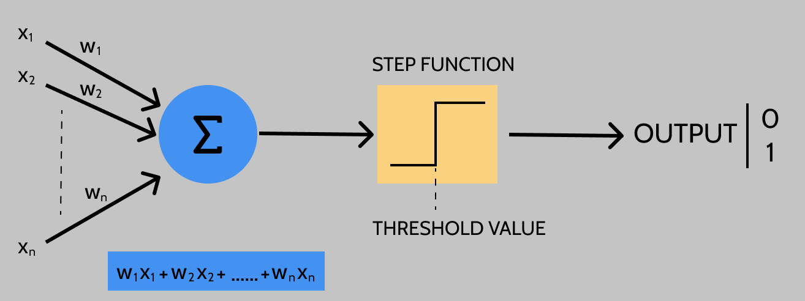
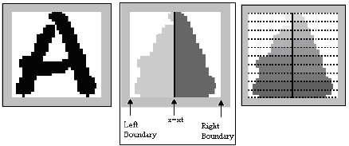
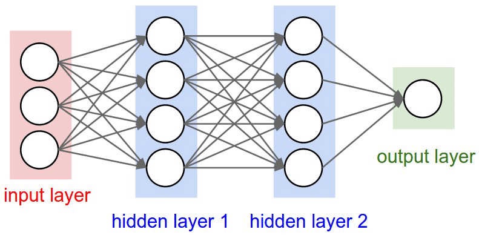

# Building simple perceptrons from scratch in TypeScript

To get started with neural networks, you start at the most basic kind of artificial neuron, the `Perceptron`, the building block of neural networks.

### The origins of perceptrons

Image Source: Biological Stack Exchange

Warren McCullouch and Walter Pitts, in their paper titled, "A logical calculus of the ideas immanent in nervous activity" describe some characteristic behaviors about how the human brain functions. Our nervous system is a net of neurons. Each neuron is separate from other neurons by synapses. A neuron receives excitation impulses via its dendrites from other neurons. Based on these impulses received, the neuron determines if the excitation exceeds some threshold. If it does exceed, the neuron propagates the excitation impulse, else it does not. This is described by the authors as the "all-or-none" characteristic of nervous activity.

You can find a link to the paper [here](https://www.cs.cmu.edu/~./epxing/Class/10715/reading/McCulloch.and.Pitts.pdf).

Artificial Neurons work on similar principles, and a perceptron is a type of artificial neuron. Perceptrons were developed in the 1950s by the scientist Frank Rosenblatt. At the time however, misunderstood citations to the work of Marvin Minsky, a scientific rival, discredited this line of research. The basis of this discreditation was: it is impossible for perceptrons to learn an XOR function. While this may be true for single layer perceptrons, it became widely conjectured that the same was true for multi-layer perceptron networks. Today, we know this is not true and in this post, we will build a simple XOR perceptron using TypeScript.

### How perceptrons work?

A perceptron takes several binary inputs: `x1, x2, ... xn` and produces a single binary output as shown in the mathematical model above. Each input is associated with a corresponding weight, `w1, w2, ... wn` which express the importance of the respective inputs when calculating the output. Once we calculate the weighted sum of all the inputs, we pass them through a step function which returns 1, if the sum is greater than a threshold value, else returns 0. The value returned is our output, or the `Prediction` of our model.

The perceptron we described above is a type of linear classifier, an algorithm that makes predictions based on a linear predictor function (as given by the weighted sum equation). More specifically, it is a binary classifier, a function which can determine whether an input (represented by a feature vector) belongs to a specific class. An image classifiers for optical character recognition (OCR) for a single character is an example of a binary classifier.

Image Source: ResearchGate.net

From the given image, you extract and identify useful features that best represent your data. You then use algorithms for edge detection, corner detection etc. to help you parse your given image (as pixel data) and construct your feature vector. Using this feature vector, your neuron will then classify the identified character as "A" or "Not A". In this post, we do not focus on feature extraction and instead assume that we are already given a feature vector.

In the model diagram above, what we see is a single layer perceptron. We have one input layer (`x1` to `xn`) and one output layer (denoted by 1 and 0) and one layer in between that takes the input and calculates the output. Typically, for real world problems, we need a multilayer perceptron (MLP) which consists of more than one layer between the input and output. Such a neural network is called as a Deep Neural Network (DNN). In media, images of neural networks shown are typically deep neural networks, and you might have seen convoluted networks like the following image (if not more convoluted).

